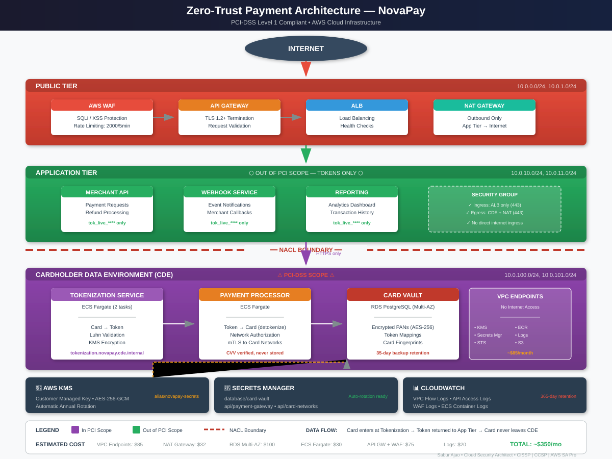

# Cloud Security Portfolio

Three reference architectures for regulated cloud environments. Each one ships Terraform modules, architecture decision records explaining why the design is what it is, and a compliance mapping to the framework that actually governs the workload.

Built by Sabur Ajao (CISSP, CCSP, AWS Solutions Architect, MBA Kellogg). MIT licensed.

## The Three Architectures

| Architecture | Domain | Regulatory Driver | What It Demonstrates |
|--------------|--------|-------------------|----------------------|
| [AWS Landing Zone](landing-zone/) | Healthcare (MedFlow) | HIPAA Security Rule, NIS2 | Multi-account isolation, Transit Gateway route-table separation, centralized security baseline |
| [Zero-Trust for Fintech](zero-trust/) | Payments (NovaPay) | PCI-DSS v4.0 | CDE isolation, tokenization, API-layer defense, zero standing credentials |
| [AI Security](ai-security/) | Healthcare AI (MedAssist) | HIPAA, NIST AI RMF | Risk tiering and governance, PHI protection in inference, prompt injection defense |

Totals across the repo: 10 Terraform modules, 11 architecture decision records, 40 Terraform files.

---

## AWS Landing Zone

Multi-account AWS foundation for a healthcare system handling PHI. Prod and dev cannot reach each other at the network layer. Security and shared services can reach everything.

**Modules**

| Module | Purpose |
|--------|---------|
| [vpc](landing-zone/terraform/modules/vpc/) | Three-tier VPC (public, private, data) with NAT, flow logs, and gateway endpoints. Data tier has no internet route. |
| [transit-gateway](landing-zone/terraform/modules/transit-gateway/) | Hub with three route tables enforcing prod/dev isolation |
| [tgw-attachment](landing-zone/terraform/modules/tgw-attachment/) | VPC-to-TGW connectivity, association, and route propagation |
| [security-baseline](landing-zone/terraform/modules/security-baseline/) | CloudTrail with log file validation, GuardDuty, AWS Config rules, Security Hub |

**Decision records**

- [ADR-001: Multi-Account Strategy](landing-zone/docs/decisions/001-multi-account-strategy.md)
- [ADR-002: Network Topology](landing-zone/docs/decisions/002-network-topology.md)
- [ADR-003: Transit Gateway Architecture](landing-zone/docs/decisions/003-transit-gateway.md)
- [ADR-004: Security Baseline Architecture](landing-zone/docs/decisions/004-security-baseline.md)

**Compliance:** [HIPAA mapping](landing-zone/terraform/modules/security-baseline/README.md) covering 164.312(b) audit controls, 164.308(a)(1) risk analysis, 164.308(a)(6) incident procedures, and 164.312(e)(1) transmission security. [Full NIS2 Directive mapping](landing-zone/docs/nis2-compliance.md) for EU entities.

**Cost:** roughly $350/month for a small environment. Transit Gateway hub plus four attachments is $180 of that. Full breakdown in the module READMEs.

---

## Zero-Trust Architecture for Fintech

NovaPay is a Series B payments company processing $50M monthly and targeting PCI-DSS Level 1 certification in 90 days. The design goal is scope reduction: keep cardholder data inside a small, hard boundary so the audit covers four services instead of forty.

**Modules**

| Module | Purpose |
|--------|---------|
| [cde-network](zero-trust/terraform/modules/cde-network/) | Cardholder Data Environment isolation via dedicated subnets, NACLs, per-service security groups, and no-internet VPC endpoints |
| [tokenization](zero-trust/terraform/modules/tokenization/) | Tokenization service on ECS with an encrypted card vault, keeping raw PAN out of application systems |
| [api-gateway](zero-trust/terraform/modules/api-gateway/) | WAF, rate limiting, usage plans, and access logging at the edge |
| [secrets-management](zero-trust/terraform/modules/secrets-management/) | KMS keys with rotation, Secrets Manager with automatic rotation, no standing credentials |

**Decision records**

- [ADR-001: Identity and Access Strategy](zero-trust/docs/decisions/001-identity-and-access.md)
- [ADR-002: Network Segmentation and CDE Isolation](zero-trust/docs/decisions/002-network-segmentation.md)
- [ADR-003: Data Protection and Tokenization](zero-trust/docs/decisions/003-data-protection.md)
- [ADR-004: API Security](zero-trust/docs/decisions/004-api-security.md)

**Environment:** [novapay-prod](zero-trust/terraform/environments/novapay-prod/) composes all four modules into a deployable configuration.



---

## AI Security Reference Architecture

MedAssist Health System is adopting AI across clinical, operational, and research domains under HIPAA. The governance problem is routing: a chatbot answering "what are your visiting hours" should not go through the same review as an AI suggesting a diagnosis.

**Modules**

| Module | Purpose |
|--------|---------|
| [ai-data-protection](ai-security/terraform/modules/ai-data-protection/) | Bedrock guardrails with PHI and MRN filters, KMS encryption, tiered S3 access, Macie classification, audit metric filters |
| [prompt-security](ai-security/terraform/modules/prompt-security/) | WAF injection rules, input analysis and output validation Lambdas, contextual grounding thresholds, EventBridge incident routing |

**Decision records**

- [ADR-001: AI Governance and Risk Tiering](ai-security/docs/decisions/001-ai-governance-and-risk-tiering.md)
- [ADR-002: Data Protection for AI Systems](ai-security/docs/decisions/002-data-protection-for-ai.md)
- [ADR-003: Prompt Injection Defense and Output Security](ai-security/docs/decisions/003-prompt-injection-defense.md)

**Full detail:** [ai-security/README.md](ai-security/README.md)

---

## Compliance Coverage

| Framework | Where |
|-----------|-------|
| HIPAA Security Rule | Landing zone security baseline, AI data protection |
| PCI-DSS v4.0 | Zero-trust CDE isolation, tokenization, API security |
| NIST Cybersecurity Framework | Landing zone (PR.AC, PR.DS, DE.CM) |
| NIST AI RMF | AI security governance and monitoring |
| NIS2 Directive (EU) | [Landing zone Article 21 and 23 mapping](landing-zone/docs/nis2-compliance.md) |
| CIS AWS Foundations Benchmark | Security Hub standards subscription in the security baseline |
| OWASP Top 10 for LLM Applications | AI security prompt injection defense |

## Design Principles

Zero trust: no implicit trust from network position. Least privilege on every identity. Defense in depth, so one failed control does not end the argument. Encryption at rest and in transit. Audit everything. All infrastructure in Terraform, no console changes.

## Getting Started

Requires Terraform 1.5.0 or later and configured AWS credentials.

```bash
git clone https://github.com/MrSabur/cloud-security-portfolio.git
cd cloud-security-portfolio

# Validate any module without AWS credentials
cd zero-trust/terraform/modules/cde-network
terraform init -backend=false && terraform validate
```

Deployment order for the landing zone is shared services first (Transit Gateway hub), then workload accounts (which attach to it). Each environment directory has its own README.

## Current State

The landing zone `security` environment and both AI security modules are written but not yet composed into deployable environment configurations. The Terraform validates; it is not wired end to end. Workload TGW attachments are staged and commented pending a RAM share.

A research AI governance ADR covering trial matching, re-identification risk, and 21 CFR Part 11 is planned and not yet published.

## License

MIT. See [LICENSE](LICENSE).

## Author

**Sabur Ajao**, Cloud Security Architect. [LinkedIn](https://linkedin.com/in/afolabisaburajao)

CISSP | CCSP | AWS Solutions Architect | MBA, Kellogg
