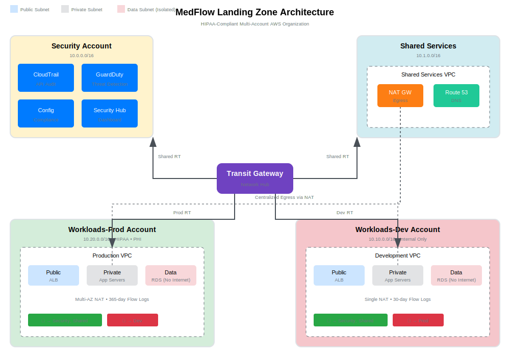

# Architecture Diagrams

Visual documentation of the MedFlow landing zone architecture.

## Diagrams

### Landing Zone Overview



**Key elements:**

| Component | Purpose |
|-----------|---------|
| Transit Gateway | Central network hub with route table isolation |
| Security Account | Centralized logging, threat detection, compliance |
| Shared Services | NAT Gateway (egress), DNS, future CI/CD |
| Workloads-Prod | Production VPCs with HIPAA controls |
| Workloads-Dev | Development VPCs with cost optimization |

### Route Table Isolation

- **Prod RT:** Routes to Security + Shared Services only
- **Dev RT:** Routes to Security + Shared Services only
- **No cross-environment routes:** Prod ↔ Dev blocked at network layer

### Subnet Tiers

| Tier | Internet Access | Contains |
|------|-----------------|----------|
| Public (blue) | Inbound via ALB | Load balancers |
| Private (gray) | Outbound via NAT | Application servers |
| Data (red) | None | Databases with PHI |

## Generating Diagrams

To regenerate using Python diagrams library:
```bash
pip install diagrams
python generate.py
```

Requires Graphviz installed on system.